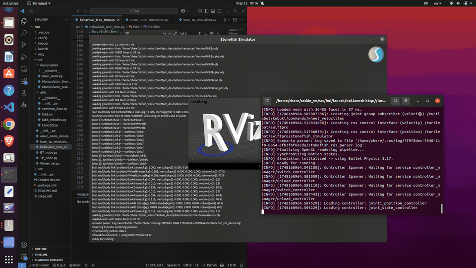
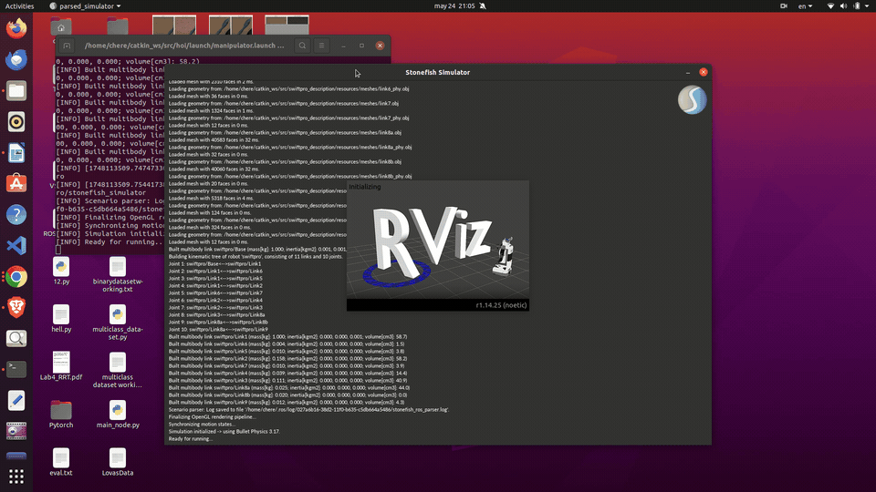
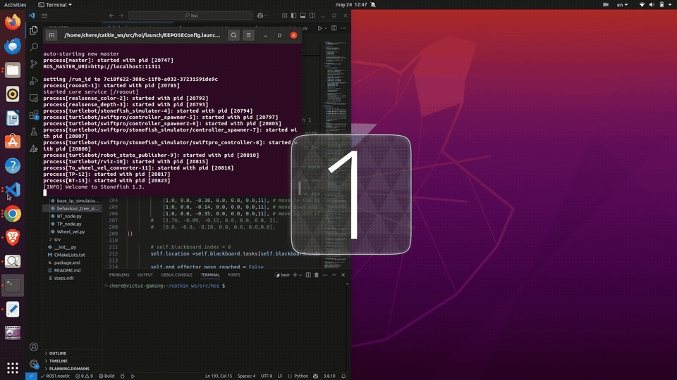
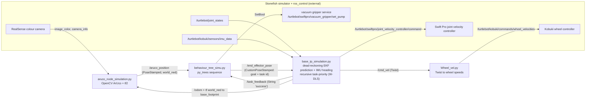

# Task-Priority Control of a Mobile Manipulator

Pick, transport and place with a Kobuki TurtleBot 2 and a uArm Swift Pro. The base and the arm are controlled together by recursive task-priority redundancy resolution, the steps are sequenced with behaviour trees, and the base is localised by dead reckoning or by ArUco markers (ROS Noetic, Stonefish simulator).



| Arm only | Pick and place, dead reckoning |
|---|---|
|  |  |

## Problem and key result

A differential-drive base with a 4-DOF arm has 6 controllable DOF (base yaw rate and forward speed, plus 4 arm joints), so the robot is redundant for an end-effector position goal. The controller stacks the tasks by priority: four joint-limit tasks first, then one goal task (base pose, end-effector position or configuration, or joint position). It solves them with weighted damped least squares and null-space projection, then scales the result so that no joint or base velocity exceeds its limit.

What the code in this repository does:

- **Limits and thresholds.** Joint limits are [-1.571, 1.571] rad for joints 1 and 4 and [-1.571, 0.05] rad for joints 2 and 3. The activation and deactivation margins are 0.05 / 0.09 rad. Velocities are capped at 0.2 (dead reckoning) or 0.3 (ArUco).
- **Goal acceptance.** A goal counts as reached when the task error norm drops below:
  - dead reckoning (`TP_node.py`): 0.03 for both base and end-effector goals.
  - ArUco (`base_tp_simulation.py`): 0.07 for the base, 0.04 for end-effector and joint goals.
- **ArUco approach.** Markers are 0.05 m. The base stops 0.29 m before the detected marker, measured along x.
- **Result.** The report in [`docs/`](docs/vehicle_manipulator_task_priority_report.pdf) and the GIFs above document the pick, transport and place sequence in the Stonefish simulation, for both dead-reckoning and ArUco-based localisation. The report's trajectory, error and joint-velocity plots show the task error converging at each goal.
  - TODO: report measured end-effector accuracy and execution time. No quantitative results are stored in this repository.

## Architecture

The nodes and topics below come from the source files in `src/` and from `launch/pick_place_aruco.launch`. The dead-reckoning variant (`launch/pick_place_dead_reckoning.launch`) is wired the same way, except that `BT_node.py` replaces `behaviour_tree_simu.py`, `TP_node.py` replaces `base_tp_simulation.py`, and there is no ArUco node; its goals are hard-coded.



Task ids carried in `CustomPoseStamped.id` (see `goal_callback` in the controller nodes):

| id | Task | Defined in |
|---|---|---|
| 2 | Base pose `[x, y, z, yaw]` | `src/utils/tasks3D.py` (`Base`) |
| 11 | End-effector position | `Position3D` |
| 4 | End-effector configuration (`TP_node.py` only) | `Configuration3D` |
| 3 | Joint position | `JointPosition` |
| always | Joint limits of the 4 arm joints (highest priority) | `JointLimitTask` |

## Tested versions

| Component | Version | What was checked |
|---|---|---|
| Ubuntu / ROS | 20.04 / Noetic (`ros:noetic-ros-base` image, Python 3.8) | `catkin_make` and `colcon build`, message import, `rosrun` of `Wheel_vel.py` |
| Python (pure modules) | 3.10, 3.12 with NumPy | import of `utils.common_func`, `utils.tasks3D`, `Manipulator_task` |
| Stonefish simulation | Ubuntu 20.04 + ROS Noetic (authors' setup) | not checked here: needs a GPU and the external packages listed below |

## Install

The steps below were verified on ROS Noetic. They build the package and generate its messages.

```bash
mkdir -p ~/catkin_ws/src && cd ~/catkin_ws/src
git clone https://github.com/Rudip1/hands_on_intervention.git mobile_manipulator_tp
cd ~/catkin_ws
source /opt/ros/noetic/setup.bash
catkin_make            # or: catkin build
source devel/setup.bash
```

Use a devel-space build (`catkin_make` or `catkin build`). The Python nodes run from the source tree because they import the `src/utils` package next to them.

Runtime dependencies of the nodes. These are the authors' ROS Noetic packages; the apt names were not re-checked for this release:

```bash
sudo apt install ros-noetic-tf ros-noetic-tf2-ros ros-noetic-tf2-geometry-msgs \
  ros-noetic-cv-bridge ros-noetic-py-trees ros-noetic-rviz ros-noetic-xacro \
  ros-noetic-robot-state-publisher ros-noetic-controller-manager \
  ros-noetic-rqt-robot-steering python3-numpy python3-scipy python3-matplotlib python3-opencv
```

The simulation launch files also need these packages in the same workspace:

- [Stonefish](https://github.com/patrykcieslak/stonefish) and [stonefish_ros](https://github.com/patrykcieslak/stonefish_ros)
- `turtlebot_simulation`, `turtlebot_description` and `swiftpro_description`. They provide the scenario files (`turtlebot_hoi.scn`, `swiftpro_basic.scn`), the controller configs and the URDFs.
  - TODO: add the source links for these three packages.

### Smoke test (verified)

This runs without the simulator:

```bash
roscore &
rosrun mobile_manipulator_tp Wheel_vel.py &
rostopic pub -r 5 /cmd_vel geometry_msgs/Twist '{linear: {x: 0.1}, angular: {z: 0.5}}' &
rostopic echo -n 1 /turtlebot/kobuki/commands/wheel_velocities
# data: [4.535714285714286, 1.1785714285714286]   (right, left wheel speed in rad/s)
```

## Run (simulation)

These commands come from the launch files. They were **not** re-run for this release, because they need the external simulation packages and a display.

```bash
# Arm only: task-priority control of the uArm Swift Pro
roslaunch mobile_manipulator_tp manipulator_only.launch

# Full pick, transport and place, predefined goals, dead-reckoning localisation
roslaunch mobile_manipulator_tp pick_place_dead_reckoning.launch

# Full pick, transport and place, goal taken from ArUco marker detection
roslaunch mobile_manipulator_tp pick_place_aruco.launch
```

When the node is stopped (Ctrl-C), the controller nodes plot the base and end-effector paths, the task error and the joint velocities with Matplotlib.

## Results

- `media/` holds the simulation recordings (GIFs above): the arm-only controller, pick and place with dead reckoning, and pick, transport and place with ArUco feedback.
- [`docs/vehicle_manipulator_task_priority_report.pdf`](docs/vehicle_manipulator_task_priority_report.pdf) covers the system design, the kinematics, the task-priority formulation, the behaviour trees, and trajectory, error and joint-velocity plots for each experiment.
- [`docs/report_kinematics_Pravin.pdf`](docs/report_kinematics_Pravin.pdf) derives the forward kinematics and Jacobian of the Swift Pro on the TurtleBot base.

## Repository layout

```
.
├── CMakeLists.txt, package.xml   catkin package mobile_manipulator_tp (message generation)
├── msg/CustomPoseStamped.msg     goal pose + task id sent from the behaviour tree to the controller
├── srv/Goalreached.srv           service definition (generated, not used by the nodes)
├── launch/                       simulation, dead-reckoning, ArUco and arm-only launch files
├── config/                       RViz configurations
├── src/
│   ├── TP_node.py                task-priority controller, dead-reckoning variant
│   ├── base_tp_simulation.py     task-priority controller, ArUco variant
│   ├── BT_node.py                behaviour tree with predefined goals
│   ├── behaviour_tree_simu.py    behaviour tree driven by ArUco detections
│   ├── aruco_node_simulation.py  ArUco marker detection and pose in world_ned
│   ├── Wheel_vel.py              Twist to Kobuki wheel velocities
│   ├── utils/common_func.py      DH transforms, Jacobians, (weighted) DLS
│   ├── utils/tasks3D.py          task classes for the mobile manipulator
│   └── manipulator/              arm-only controller, kinematics node and tasks
├── media/                        demo GIFs
├── docs/                         project reports (PDF)
└── .github/workflows/ci.yml      build and import checks
```

## Acknowledgements

This project was developed jointly by **Pravin Oli** and **Gebrecherkos G.**

It builds on the [Stonefish](https://github.com/patrykcieslak/stonefish) simulator and its ROS bridge by Patryk Cieślak, and on the [py_trees](https://github.com/splintered-reality/py_trees) behaviour-tree library.

## Licence

Released under the [Apache License 2.0](LICENSE). Citation metadata is in [`CITATION.cff`](CITATION.cff).
